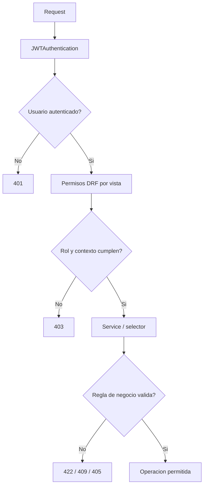

# README de Permisos y Seguridad - Sistema Inventario ICM

Este documento consolida el modelo de autenticacion, autorizacion y permisos del backend ICM a partir del codigo real del repositorio. Su objetivo es servir como referencia tecnica para desarrollo, arquitectura, QA y stakeholders tecnicos.

## 1. Proposito y alcance

El sistema usa un monolito modular Django con API REST bajo `/api/v1/`. La seguridad se apoya en JWT Bearer, RBAC con permisos de DRF, reglas contextuales en servicios y auditoria inmutable.

Fuentes principales:

- [README de API](README_API.md)
- [README de Arquitectura](../README_ARQUITECTURA.md)
- [Restricciones del sistema](../calidad_restricciones/README_RESTRICCIONES.md)
- [Configuracion base](../../config/settings/base.py)
- [Permisos compartidos](../../shared/permissions.py)
- [Modelo de usuario](../../apps/authentication/models.py)

## 2. Roles del sistema — lectura importante

El codigo define tres roles nativos en el modelo `User` (campo `role`):

| Rol en codigo | Permiso DRF | Descripcion real | Columna en la matriz |
|---|---|---|---|
| `almacenista` | `IsAlmacenista` | **Rol rector del sistema.** Control total operativo y administrativo (BR-02). Crea usuarios, gestiona catalogo, ejecuta todos los movimientos, administra webhooks. | **Supervisor** |
| `auxiliar_despacho` | `IsAuxiliarDespacho` | Operaciones de campo (entradas, despachos, traslados) dentro de franja horaria (BR-03). | **Operador** |
| `administrador` | `IsAdministrador` | **Solo lectura.** Accede a reportes, alertas y auditoria. No puede crear movimientos, usuarios ni configurar integraciones. | **Admin** |

> ⚠️ **Nota critica:** El rol `almacenista` es el "administrador funcional" del negocio. El rol `administrador` es unicamente un observador de lectura. Esta convencion es interna al codigo; la columna "Admin" en la matriz corresponde al rol `administrador` (lectura), no al `almacenista` (control total).

Equivalentes adicionales de la matriz:
- Cliente = rol no nativo; denegado por defecto.
- Invitado = usuario anonimo (sin JWT).

### Clases de permiso utilizadas en el sistema

| Clase | Archivo | Roles que pasan | Uso principal |
|---|---|---|---|
| `IsAlmacenista` | `shared/permissions.py` | `almacenista` | Escrituras criticas: usuarios, catalogo, movimientos, webhooks, dashboard |
| `IsAuxiliarDespacho` | `shared/permissions.py` | `auxiliar_despacho` | No se usa directamente en vistas; se delega a `IsAlmacenistaOrAuxiliar` |
| `IsAdministrador` | `shared/permissions.py` | `administrador` | **No se usa en ningun endpoint actual.** Solo lectura via `IsAlmacenistaOrAdministrador` |
| `IsAlmacenistaOrAuxiliar` | `shared/permissions.py` | `almacenista`, `auxiliar_despacho` | Entradas, despachos, traslados, correcciones |
| `IsAlmacenistaOrAdministrador` | `shared/permissions.py` | `almacenista`, `administrador` | Reportes, alertas (lectura), auditoria |
| `IsAlmacenistaOrReadOnly` | `apps/catalog/permissions.py` | Lectura: todos autenticados; Escritura: solo `almacenista` | Detalle de productos, categorias, combos en catalogo |
| `IsAuthenticated` | DRF built-in | Cualquier usuario con JWT valido | Endpoints de lectura abierta: inventario, movimientos, perfil, logout |
| `IsWithinOperatingHours` | `shared/permissions.py` | Todos, pero restringe `auxiliar_despacho` a franja horaria | Aplicado globalmente en DRF config; la restriccion solo aplica al auxiliar |
| `AllowAny` | DRF built-in | Cualquiera sin JWT | Solo `GET /auth/health/` |

> ℹ️ El rol `administrador` nunca aparece solo como permiso en ningun vista. Su acceso siempre es via `IsAlmacenistaOrAdministrador` que le permite solo lectura.

## 3. Resumen ejecutivo del modelo de seguridad

### 3.1 Autenticacion

El backend usa `djangorestframework-simplejwt` con autenticacion `JWTAuthentication`.

- Login por `username` o `email`.
- Se emiten `access` y `refresh`.
- El refresh se rota y se blanquea en blacklist tras rotacion.
- El logout invalida el `refresh` enviado en el cuerpo.
- La deshabilitacion de usuarios revoca todos sus tokens outstanding.
- Las contrasenas se almacenan con el hashing nativo de Django (`set_password()` sobre `AbstractUser`).

### 3.2 Autorizacion

La autorizacion combina:

- RBAC por rol con permisos DRF.
- Reglas contextuales en servicios, por ejemplo horario operativo de `auxiliar_despacho`.
- Reglas de negocio por accion, por ejemplo inmutabilidad del ledger y ventanas de correccion.

No se encontro un motor ABAC, policies framework ni middleware propio de autorizacion. El control se realiza con `permissions.py`, serializers y services.

### 3.3 Tokens

Tokens presentes:

- Access token
- Refresh token

Propiedades reales del proyecto:

- `access` y `refresh` se generan al autenticar.
- Los tokens incluyen claims estandar de SimpleJWT y claims personalizados: `user_id`, `role`, `email`, `username`.
- El refresh se rota y se invalida en blacklist al renovarse.
- El logout y la deshabilitacion de cuentas agregan los tokens outstanding a blacklist.
- El algoritmo es `HS256` y la firma usa `SECRET_KEY`.

### 3.4 Transporte y hardening

- En produccion se fuerza HTTPS con `SECURE_SSL_REDIRECT`.
- `CORS` se restringe por entorno.
- Hay `SecurityMiddleware`, `CsrfViewMiddleware` y `XFrameOptionsMiddleware` de Django.
- No se encontro un paquete tipo Helmet ni un middleware custom equivalente.
- Hay throttling de DRF en base (`AnonRateThrottle` y `UserRateThrottle`), aunque test lo desactiva.

## 4. Diagrama de autenticacion

```mermaid
flowchart TD
    A[Cliente HTTP] --> B[POST /api/v1/auth/login/]
    B --> C[Serializer valida username/email/password]
    C --> D[authenticate_user()]
    D -->|credenciales validas| E[RefreshToken.for_user()]
    E --> F[Claims personalizados: user_id, role, email, username]
    F --> G[Respuesta con access + refresh + profile]
    D -->|credenciales invalidas| H[Error uniforme 401/403]
    G --> I[Requests con Authorization: Bearer <access>]
    I --> J[JWTAuthentication]
    J --> K[Permisos DRF por rol]
    K --> L[Servicios de dominio]
```

## 5. Diagrama de autorizacion



## 6. Fuentes de seguridad en el codigo

| Area | Evidencia | Observacion |
|---|---|---|
| JWT y blacklist | [config/settings/base.py](../../config/settings/base.py), [apps/authentication/serializers.py](../../apps/authentication/serializers.py), [apps/authentication/views.py](../../apps/authentication/views.py) | SimpleJWT con rotacion de refresh y blacklist |
| RBAC base | [shared/permissions.py](../../shared/permissions.py) | Permisos por rol y permiso de horario |
| Restriccion horaria | [apps/authentication/services.py](../../apps/authentication/services.py) | America/Bogota, 07:00-12:00 y 14:00-17:00 |
| Errores uniformes | [config/exception_handler.py](../../config/exception_handler.py) | Respuesta JSON uniforme `{ error, message, detail }` |
| Auditoria | [apps/audit/services.py](../../apps/audit/services.py), [apps/audit/models.py](../../apps/audit/models.py) | Logs inmutables con metadata e IP |
| CORS y hardening | [config/settings/base.py](../../config/settings/base.py), [config/settings/production.py](../../config/settings/production.py) | Origenes restringidos y HTTPS en produccion |

## 7. Variables de entorno relacionadas con seguridad

| Variable | Uso | Valor por defecto o entorno |
|---|---|---|
| `DJANGO_SECRET_KEY` | Firma de JWT y secretos de Django | Requerida en produccion; en base existe fallback inseguro solo para desarrollo |
| `DJANGO_DEBUG` | Modo debug | `False` en base, `True` en desarrollo |
| `DJANGO_ALLOWED_HOSTS` | Hosts permitidos | Lista separada por coma |
| `APP_TIMEZONE` | Zona horaria de ejecucion | `America/Bogota` |
| `JWT_ACCESS_TOKEN_LIFETIME_MINUTES` | Duracion del access token | 60 minutos por defecto en base |
| `JWT_REFRESH_TOKEN_LIFETIME_DAYS` | Duracion del refresh token | 7 dias por defecto en base |
| `CORS_ALLOWED_ORIGINS` | Origenes web permitidos | Lista separada por coma |
| `FRONTEND_URL` | Origen permitido en produccion | Usado para CORS en `production.py` |

## 8. Ciclo de vida de los tokens

### 8.1 Access token

- Se genera en el login.
- Se deriva del refresh.
- Se usa en `Authorization: Bearer <access>`.
- Duracion base: 60 minutos.
- En desarrollo se amplía a 24 horas.
- En produccion permanece en 60 minutos.

### 8.2 Refresh token

- Se genera junto con el access en el login.
- Duracion base: 7 dias.
- En desarrollo se amplía a 30 dias.
- En produccion permanece en 7 dias.
- Rotacion activada: si se usa para renovar, el nuevo refresh invalida el anterior.
- Blacklist activado: los refresh rotados o revocados no deben reutilizarse.

### 8.3 Claims observados

Claims personalizados agregados por el proyecto:

- `user_id`
- `role`
- `email`
- `username`

Claims estandar de SimpleJWT presentes por defecto:

- `token_type`
- `exp`
- `iat`
- `jti`

### 8.4 Invalidacion

- `POST /api/v1/auth/logout/` blacklistea el refresh recibido.
- `disable_user()` blacklistea todos los tokens outstanding del usuario.
- Si el refresh ya expiro o fue revocado, el endpoint devuelve error uniforme.

## 9. Modelo de autorizacion

### 9.1 RBAC real

El sistema usa RBAC puro sobre tres roles nativos.

- `almacenista`: gestion operativa, catalogo, inventario, movimientos criticos, usuarios y reportes.
- `auxiliar_despacho`: despacho y operaciones de campo en ventanas y rutas permitidas.
- `administrador`: lectura de reportes, alertas y auditoria; no es superusuario funcional para todas las operaciones.

### 9.2 Regla contextual de horario

La franja operativa del auxiliar se valida en:

- login
- refresh token

Rango local America/Bogota:

- 07:00-12:00
- 14:00-17:00

### 9.3 Regla contextual de inmutabilidad

Los movimientos y logs de auditoria son inmutables. Cuando una accion intenta alterar un registro cerrado, el sistema devuelve `405 Method Not Allowed` o un error de dominio equivalente.

### 9.4 Observacion importante

La configuracion base define `IsWithinOperatingHours` como permiso global por defecto, pero varias vistas reemplazan `permission_classes` de forma explicita. En consecuencia, la restriccion horaria no se aplica de manera uniforme a toda la API y queda garantizada solo donde la vista o el servicio la implementan expresamente.

## 10. Superficie publica y protegida

### 10.1 Rutas publicas reales

| Ruta | Metodo | Estado | Comentario |
|---|---|---|---|
| `/api/v1/auth/health/` | GET | Publica | Health check sin autenticacion |
| `/api/v1/auth/login/` | POST | Publica condicionada | Requiere credenciales validas y respeta BR-03 para auxiliar |
| `/api/v1/auth/token/refresh/` | POST | Publica condicionada | Requiere refresh valido y respeta BR-03 para auxiliar |
| `/api/schema/` | GET | Publica | Esquema OpenAPI |
| `/api/docs/` | GET | Publica | Swagger UI |
| `/api/redoc/` | GET | Publica | ReDoc |

### 10.2 Rutas protegidas

Todo el resto de la API requiere JWT valido, salvo casos especificos documentados en la matriz.

## 11. Matriz de permisos

Leyenda:

- Permitido: acceso directo segun permisos del codigo.
- Parcial o condicionado: acceso sujeto a credenciales, horario, rol en el servicio o regla de negocio.
- Denegado: el codigo no permite el acceso para ese perfil.

### 11.1 Autenticacion y gestion de usuarios

| Recurso | Accion | Endpoint | Admin | Supervisor | Operador | Cliente | Invitado | Observaciones |
|---|---|---|---|---|---|---|---|---|
| Autenticacion | Leer estado | `GET /api/v1/auth/health/` | Permitido | Permitido | Permitido | Denegado | Permitido | Publico; no requiere JWT |
| Autenticacion | Iniciar sesion | `POST /api/v1/auth/login/` | Parcial o condicionado | Parcial o condicionado | Parcial o condicionado | Denegado | Parcial o condicionado | Requiere credenciales; operador ademas respeta horario |
| Autenticacion | Renovar token | `POST /api/v1/auth/token/refresh/` | Parcial o condicionado | Parcial o condicionado | Parcial o condicionado | Denegado | Parcial o condicionado | Requiere refresh valido; operador respeta horario |
| Autenticacion | Cerrar sesion | `POST /api/v1/auth/logout/` | Permitido | Permitido | Permitido | Denegado | Denegado | Requiere JWT valido (`IsAuthenticated`); invalida refresh enviado en body |
| Autenticacion | Ver perfil propio | `GET /api/v1/auth/me/` | Permitido | Permitido | Permitido | Denegado | Denegado | Solo autenticado |
| Usuarios | Listar usuarios | `GET /api/v1/auth/users/` | Permitido | Permitido | Denegado | Denegado | Denegado | Vista permite admin o almacenista |
| Usuarios | Crear usuario | `POST /api/v1/auth/users/` | Denegado | Permitido | Denegado | Denegado | Denegado | La vista acepta admin, pero el servicio exige almacenista |
| Usuarios | Ver detalle | `GET /api/v1/auth/users/<uuid:pk>/` | Permitido | Permitido | Denegado | Denegado | Denegado | Solo admin o almacenista |
| Usuarios | Actualizar total | `PUT /api/v1/auth/users/<uuid:pk>/` | Denegado | Permitido | Denegado | Denegado | Denegado | Admin pasa la vista, pero el servicio rechaza |
| Usuarios | Actualizar parcial | `PATCH /api/v1/auth/users/<uuid:pk>/` | Denegado | Permitido | Denegado | Denegado | Denegado | Misma logica que PUT |
| Usuarios | Deshabilitar usuario | `POST /api/v1/auth/users/<uuid:pk>/disable/` | Denegado | Permitido | Denegado | Denegado | Denegado | Solo almacenista |

### 11.2 Catalogo

| Recurso | Accion | Endpoint | Admin | Supervisor | Operador | Cliente | Invitado | Observaciones |
|---|---|---|---|---|---|---|---|---|
| Catalogo - categorias | Leer | `GET /api/v1/catalog/categories/` | Permitido | Permitido | Permitido | Denegado | Denegado | Solo autenticado |
| Catalogo - categorias | Crear | `POST /api/v1/catalog/categories/` | Denegado | Permitido | Denegado | Denegado | Denegado | Escritura solo almacenista |
| Catalogo - subcategorias | Leer | `GET /api/v1/catalog/subcategories/` | Permitido | Permitido | Permitido | Denegado | Denegado | Solo autenticado |
| Catalogo - subcategorias | Crear | `POST /api/v1/catalog/subcategories/` | Denegado | Permitido | Denegado | Denegado | Denegado | Escritura solo almacenista |
| Catalogo - productos | Leer | `GET /api/v1/catalog/products/` | Denegado | Permitido | Denegado | Denegado | Denegado | La vista exige almacenista para toda la operacion |
| Catalogo - productos | Crear | `POST /api/v1/catalog/products/` | Denegado | Permitido | Denegado | Denegado | Denegado | Reglas de SKU y dominio en services |
| Catalogo - producto detalle | Leer | `GET /api/v1/catalog/products/<uuid:pk>/` | Permitido | Permitido | Permitido | Denegado | Denegado | Lectura autenticada |
| Catalogo - producto detalle | Actualizar | `PUT /api/v1/catalog/products/<uuid:pk>/` | Denegado | Permitido | Denegado | Denegado | Denegado | Solo almacenista |
| Catalogo - producto detalle | Actualizar parcial | `PATCH /api/v1/catalog/products/<uuid:pk>/` | Denegado | Permitido | Denegado | Denegado | Denegado | Solo almacenista |
| Catalogo - resolver identificador | Buscar | `GET /api/v1/catalog/resolve/` | Permitido | Permitido | Permitido | Denegado | Denegado | Alias tambien disponible en `/products/resolve/` |
| Catalogo - combos | Leer | `GET /api/v1/catalog/combos/` | Permitido | Permitido | Permitido | Denegado | Denegado | Lectura autenticada |
| Catalogo - combos | Crear | `POST /api/v1/catalog/combos/` | Denegado | Permitido | Denegado | Denegado | Denegado | Solo almacenista |

### 11.3 Inventario

| Recurso | Accion | Endpoint | Admin | Supervisor | Operador | Cliente | Invitado | Observaciones |
|---|---|---|---|---|---|---|---|---|
| Inventario consolidado | Leer / Exportar | `GET /api/v1/inventory/` | Permitido | Permitido | Permitido | Denegado | Denegado | Filtros por categoria, ubicacion y stock. Soporta `?export=csv\|xlsx` |
| Ubicaciones | Leer | `GET /api/v1/inventory/locations/` | Permitido | Permitido | Permitido | Denegado | Denegado | Solo autenticado |
| Ubicaciones | Crear | `POST /api/v1/inventory/locations/` | Denegado | Permitido | Denegado | Denegado | Denegado | Solo almacenista |
| Ubicacion detalle | Leer | `GET /api/v1/inventory/locations/<uuid:pk>/` | Permitido | Permitido | Permitido | Denegado | Denegado | Solo autenticado |
| Ubicacion detalle | Actualizar total | `PUT /api/v1/inventory/locations/<uuid:pk>/` | Denegado | Permitido | Denegado | Denegado | Denegado | Solo almacenista |
| Ubicacion detalle | Actualizar parcial | `PATCH /api/v1/inventory/locations/<uuid:pk>/` | Denegado | Permitido | Denegado | Denegado | Denegado | Solo almacenista |
| Ubicacion detalle | Eliminar / desactivar | `DELETE /api/v1/inventory/locations/<uuid:pk>/` | Denegado | Permitido | Denegado | Denegado | Denegado | Baja logica; archiva la ubicacion |
| Transicion de estado | Ejecutar | `POST /api/v1/inventory/locations/<uuid:pk>/state-transitions/` | Denegado | Permitido | Denegado | Denegado | Denegado | Cambia operational_status; solo almacenista |
| Tipos de almacenamiento | Leer | `GET /api/v1/inventory/storage-types/` | Permitido | Permitido | Permitido | Denegado | Denegado | Solo autenticado |
| Tipos de almacenamiento | Crear/Actualizar/Eliminar | `POST/PUT/PATCH/DELETE /api/v1/inventory/storage-types/<uuid:pk>/` | Denegado | Permitido | Denegado | Denegado | Denegado | Solo almacenista; tipos sistema no se eliminan |
| Plantillas de ubicacion | Leer | `GET /api/v1/inventory/storage-templates/` | Permitido | Permitido | Permitido | Denegado | Denegado | Solo autenticado |
| Plantillas de ubicacion | Crear/Actualizar/Eliminar | `POST/PUT/PATCH/DELETE /api/v1/inventory/storage-templates/<uuid:pk>/` | Denegado | Permitido | Denegado | Denegado | Denegado | Solo almacenista |
| Reconstruccion de stock | Ejecutar | `POST /api/v1/inventory/reconstruct/` | Denegado | Permitido | Denegado | Denegado | Denegado | Solo almacenista; recalcula desde ledger |
| Stock por producto | Leer | `GET /api/v1/inventory/products/<uuid:product_id>/stock/` | Permitido | Permitido | Permitido | Denegado | Denegado | Alias disponible en `/stock/product/` |
| Stock por ubicacion | Leer | `GET /api/v1/inventory/stock/location/<uuid:location_id>/` | Permitido | Permitido | Permitido | Denegado | Denegado | Solo autenticado |
| Umbral de stock por ubicacion | Actualizar | `PATCH /api/v1/inventory/stock/<uuid:pk>/threshold/` | Denegado | Permitido | Denegado | Denegado | Denegado | **[NUEVO]** Override local de reorder_point; solo almacenista |
| Busqueda de productos | Buscar | `GET /api/v1/inventory/search/` | Permitido | Permitido | Permitido | Denegado | Denegado | Query params `q`, `category`, `subcategory` |

### 11.4 Movimientos

| Recurso | Accion | Endpoint | Admin | Supervisor | Operador | Cliente | Invitado | Observaciones |
|---|---|---|---|---|---|---|---|---|
| Movimientos | Leer | `GET /api/v1/movements/` | Permitido | Permitido | Permitido | Denegado | Denegado | Listado general del ledger |
| Entradas | Leer | `GET /api/v1/movements/entries/` | Permitido | Permitido | Permitido | Denegado | Denegado | Solo autenticado |
| Entradas | Crear | `POST /api/v1/movements/entries/` | Denegado | Permitido | Permitido | Denegado | Denegado | Operador habilitado por vista y servicio |
| Entrada detalle | Leer | `GET /api/v1/movements/entries/<uuid:pk>/` | Permitido | Permitido | Permitido | Denegado | Denegado | Solo autenticado |
| Despachos | Leer | `GET /api/v1/movements/dispatches/` | Permitido | Permitido | Permitido | Denegado | Denegado | Solo autenticado |
| Despachos | Crear | `POST /api/v1/movements/dispatches/` | Denegado | Permitido | Permitido | Denegado | Denegado | Incluye validacion cruzada y protecciones de datos |
| Despacho detalle | Leer | `GET /api/v1/movements/dispatches/<uuid:pk>/` | Permitido | Permitido | Permitido | Denegado | Denegado | Solo autenticado |
| Factura de despacho | Exportar | `GET /api/v1/movements/dispatches/<uuid:pk>/invoice/` | Denegado | Permitido | Permitido | Denegado | Denegado | Descarga de PDF — Aplica BR-13, BR-16, BR-17 |
| Traslados | Leer | `GET /api/v1/movements/transfers/` | Permitido | Permitido | Permitido | Denegado | Denegado | Solo autenticado |
| Traslados | Crear | `POST /api/v1/movements/transfers/` | Denegado | Permitido | Permitido | Denegado | Denegado | Combo de ubicaciones y stock |
| Devoluciones | Leer | `GET /api/v1/movements/returns/` | Denegado | Permitido | Denegado | Denegado | Denegado | Solo almacenista |
| Devoluciones | Crear | `POST /api/v1/movements/returns/` | Denegado | Permitido | Denegado | Denegado | Denegado | Serial obligatorio cuando aplica |
| Ajustes | Leer | `GET /api/v1/movements/adjustments/` | Denegado | Permitido | Denegado | Denegado | Denegado | Solo almacenista |
| Ajustes | Crear | `POST /api/v1/movements/adjustments/` | Denegado | Permitido | Denegado | Denegado | Denegado | Justificacion obligatoria |
| Correccion de ajuste | Ejecutar | `POST /api/v1/movements/adjustments/correct/` | Denegado | Permitido | Permitido | Denegado | Denegado | Condicionado por ventana de correccion |
| Movimiento detalle | Leer | `GET /api/v1/movements/<uuid:pk>/` | Permitido | Permitido | Permitido | Denegado | Denegado | Cualquier otro metodo registra intento inmutable |
| Correccion de movimiento | Ejecutar | `POST /api/v1/movements/<uuid:pk>/corrections/` | Denegado | Permitido | Permitido | Denegado | Denegado | Solo traslados, autor y ventana valida |
| Despacho de combo | Ejecutar especial | `POST /api/v1/movements/combo-dispatch/` | Denegado | Permitido | Permitido | Denegado | Denegado | Descuenta por item del combo |

### 11.5 Dashboard operacional

| Recurso | Accion | Endpoint | Admin | Supervisor | Operador | Cliente | Invitado | Observaciones |
|---|---|---|---|---|---|---|---|---|
| Dashboard operacional | Leer overview | `GET /api/v1/dashboard/overview/` | Denegado | Permitido | Denegado | Denegado | Denegado | Read model operacional de UI ejecutiva; dueño funcional: almacenista |
| Dashboard operacional | Leer métricas | `GET /api/v1/dashboard/metrics/` | Denegado | Permitido | Denegado | Denegado | Denegado | Contrato composable |
| Dashboard operacional | Leer alertas | `GET /api/v1/dashboard/alerts/` | Denegado | Permitido | Denegado | Denegado | Denegado | Contrato composable |
| Dashboard operacional | Leer KPIs | `GET /api/v1/dashboard/kpis/` | Denegado | Permitido | Denegado | Denegado | Denegado | KPIs con precisión explícita |
| Dashboard operacional | Leer movimientos | `GET /api/v1/dashboard/movements/` | Denegado | Permitido | Denegado | Denegado | Denegado | Movimientos recientes para la UI |

### 11.6 Reportes

| Recurso | Accion | Endpoint | Admin | Supervisor | Operador | Cliente | Invitado | Observaciones |
|---|---|---|---|---|---|---|---|---|
| Resumen inventario | Leer | `GET /api/v1/reports/inventory/summary/` | Permitido | Permitido | Denegado | Denegado | Denegado | Solo almacenista o administrador |
| Resumen movimientos | Leer | `GET /api/v1/reports/movements/summary/` | Permitido | Permitido | Denegado | Denegado | Denegado | Rango obligatorio |
| Reporte movimientos | Leer | `GET /api/v1/reports/movements/report/` | Permitido | Permitido | Denegado | Denegado | Denegado | Filtros de rango y tipo |
| Historial movimientos | Leer / Exportar | `GET /api/v1/reports/movements/history/` | Permitido | Permitido | Denegado | Denegado | Denegado | Limite 200 registros; soporta `?export=csv\|xlsx` |
| Dataset exportable | Exportar | `GET /api/v1/reports/data/` | Permitido | Permitido | Denegado | Denegado | Denegado | Dataset unificado para exportaciones frontend |
| Resumen ventas | Leer | `GET /api/v1/reports/sales/summary/` | Permitido | Permitido | Denegado | Denegado | Denegado | Rango obligatorio |
| Top productos | Leer | `GET /api/v1/reports/top-products/` | Permitido | Permitido | Denegado | Denegado | Denegado | Limite y periodo configurables |
| Facturas | Leer | `GET /api/v1/reports/invoices/` | Permitido | Permitido | Denegado | Denegado | Denegado | Soporta paginacion |
| KPI dashboard | Leer | `GET /api/v1/reports/kpi/` | Permitido | Permitido | Denegado | Denegado | Denegado | Panel operacional; delegado a dashboard service |
| Productos por vencer | Leer / Exportar | `GET /api/v1/reports/expiring/` | Permitido | Permitido | Denegado | Denegado | Denegado | Parametro `days` (1-365); soporta `?export=csv\|xlsx` |
| Utilizacion de almacen | Leer | `GET /api/v1/reports/warehouse-utilization/` | Permitido | Permitido | Denegado | Denegado | Denegado | Distribucion por estado operativo y tipo de almacen |
| Calidad operativa | Leer | `GET /api/v1/reports/quality-operational/` | Permitido | Permitido | Denegado | Denegado | Denegado | Resumen de devoluciones y calidad |
| Descarte operativo | Leer | `GET /api/v1/reports/discard-operational/` | Permitido | Permitido | Denegado | Denegado | Denegado | Resumen de descartes por dano y vencimiento |
| Despacho operativo | Leer | `GET /api/v1/reports/dispatch-operational/` | Permitido | Permitido | Denegado | Denegado | Denegado | Resumen de despachos e invoices |
| Ordenes de despacho | Leer | `GET /api/v1/reports/dispatch-operational/orders/` | Permitido | Permitido | Denegado | Denegado | Denegado | Filtros: `start`, `end`, `invoice_number` |

### 11.7 Alertas

| Recurso | Accion | Endpoint | Admin | Supervisor | Operador | Cliente | Invitado | Observaciones |
|---|---|---|---|---|---|---|---|---|
| Alertas activas | Leer / Exportar | `GET /api/v1/alerts/` | Permitido | Permitido | Denegado | Denegado | Denegado | Solo almacenista o administrador; soporta `?export=csv\|xlsx` |
| Polling de alertas | Leer | `GET /api/v1/alerts/poll/` | Permitido | Permitido | Permitido | Denegado | Denegado | **[NUEVO]** Cualquier autenticado; params: `since`, `severity` |
| Historial de alertas | Leer | `GET /api/v1/alerts/history/` | Permitido | Permitido | Denegado | Denegado | Denegado | Alertas resueltas; mismo filtro que `/alerts/` |
| Estadisticas de alertas | Leer | `GET /api/v1/alerts/stats/` | Permitido | Permitido | Denegado | Denegado | Denegado | Conteos por severidad y categoria |
| Alerta detalle | Leer | `GET /api/v1/alerts/<uuid:pk>/` | Permitido | Permitido | Denegado | Denegado | Denegado | Solo almacenista o administrador |
| Alerta | Resolver | `POST /api/v1/alerts/<uuid:pk>/resolve/` | Denegado | Permitido | Denegado | Denegado | Denegado | Solo almacenista |

### 11.8 Auditoria

| Recurso | Accion | Endpoint | Admin | Supervisor | Operador | Cliente | Invitado | Observaciones |
|---|---|---|---|---|---|---|---|---|
| Logs de auditoria | Leer | `GET /api/v1/audit/` | Permitido | Permitido | Denegado | Denegado | Denegado | Solo almacenista o administrador |
| Log de auditoria | Leer | `GET /api/v1/audit/<uuid:pk>/` | Permitido | Permitido | Denegado | Denegado | Denegado | Solo almacenista o administrador |

### 11.9 Webhooks — NUEVO

> El modulo webhooks requiere rol **almacenista** (rol rector del sistema, BR-02).
> El `administrador` es solo lectura y NO puede gestionar webhooks.

| Recurso | Accion | Endpoint | Admin | Supervisor | Operador | Cliente | Invitado | Observaciones |
|---|---|---|---|---|---|---|---|---|
| Endpoints de webhook | Listar | `GET /api/v1/webhooks/endpoints/` | Denegado | Permitido | Denegado | Denegado | Denegado | Solo almacenista (`IsAlmacenista`) |
| Endpoints de webhook | Crear | `POST /api/v1/webhooks/endpoints/` | Denegado | Permitido | Denegado | Denegado | Denegado | Solo almacenista; requiere url, secret y events |
| Endpoint detalle | Leer | `GET /api/v1/webhooks/endpoints/<uuid:pk>/` | Denegado | Permitido | Denegado | Denegado | Denegado | Solo almacenista |
| Endpoint detalle | Actualizar | `PATCH /api/v1/webhooks/endpoints/<uuid:pk>/` | Denegado | Permitido | Denegado | Denegado | Denegado | Solo almacenista |
| Endpoint detalle | Desactivar | `DELETE /api/v1/webhooks/endpoints/<uuid:pk>/` | Denegado | Permitido | Denegado | Denegado | Denegado | Baja logica (is_active=False); solo almacenista |
| Prueba de webhook | Ejecutar | `POST /api/v1/webhooks/endpoints/<uuid:pk>/test/` | Denegado | Permitido | Denegado | Denegado | Denegado | Envia payload de prueba; solo almacenista |
| Historial de entregas | Leer | `GET /api/v1/webhooks/deliveries/` | Denegado | Permitido | Denegado | Denegado | Denegado | Solo almacenista |
| Estadisticas | Leer | `GET /api/v1/webhooks/stats/` | Denegado | Permitido | Denegado | Denegado | Denegado | Conteos pending/delivered/failed; solo almacenista |

## 12. Acciones especiales no expuestas como endpoint publico

El codigo define eventos de auditoria y reglas de negocio que sugieren acciones como aprobar o rechazar devoluciones, pero no se encontraron rutas HTTP publicas dedicadas a esas acciones en las apps revisadas.

Ejemplos de eventos internos observados en auditoria:

- `RETURN_APPROVED`
- `RETURN_REJECTED`
- `ALERT_ACKNOWLEDGED`
- `MODIFICATION_ATTEMPT_ON_IMMUTABLE_RECORD`

Interpretacion tecnica:

- Son trazas de dominio o estados de auditoria.
- No equivalen a endpoints publicos adicionales.
- Si el negocio decide exponerlos, deberan documentarse con un nuevo contrato API y con permisos especificos.

## 13. Riesgos detectados

### 13.1 Restriccion horaria no uniforme

La politica de horario del auxiliar esta implementada en login y refresh, pero no todas las vistas heredan `IsWithinOperatingHours`. Esto puede generar rutas operativas donde el usuario autenticado actua fuera de la franja si la vista no vuelve a validar el contexto.

### 13.2 El administrador no es superusuario funcional

El rol `administrador` tiene lectura privilegiada, pero no administra usuarios ni muta inventario, salvo que una vista o servicio lo permita expresamente. Es un punto importante para stakeholders acostumbrados a un modelo de superusuario clasico.

### 13.3 El entorno de prueba no reproduce toda la seguridad de produccion

En `test.py`:

- se usa SQLite en memoria,
- se desactiva throttling,
- se acelera hashing de contrasenas con MD5.

Esto es correcto para pruebas, pero limita la fidelidad frente a concurrencia y limitacion de peticiones.

### 13.4 Dependencia de `SECRET_KEY` como firma JWT

La firma HS256 es simple y practica, pero la seguridad depende directamente de la proteccion del secreto de Django. La fuga de `DJANGO_SECRET_KEY` compromete la validez criptografica de los tokens.

### 13.5 No existe ABAC formal

Las restricciones dinamicas existen, pero estan distribuidas entre permisos y servicios. No hay un motor central de policies o claims adicionales evaluados de forma declarativa.

## 14. Buenas practicas ya implementadas

- Rotacion y blacklist de refresh tokens.
- Logout que invalida refresh.
- Revocacion masiva al deshabilitar cuentas.
- Respuestas de error uniformes y tipadas.
- Auditoria inmutable con IP y metadata.
- Validaciones de dominio en services, no en views.
- Uso de `transaction.atomic` y bloqueos donde hay consistencia de stock.
- CORS restringido por entorno.
- HTTPS forzado en produccion.
- Control de acceso por rol y por contexto operativo.

## 15. Recomendaciones futuras

1. Unificar la aplicacion de `IsWithinOperatingHours` para que la ventana del auxiliar no dependa de la vista concreta.
2. Publicar una semantica explicita para acciones tipo aprobar/rechazar si el negocio las necesita como endpoint.
3. Revisar si el rol `administrador` debe seguir siendo lectura privilegiada o evolucionar a un rol con funciones de supervision mas amplias.
4. Considerar pruebas de concurrencia y de throttling mas cercanas a produccion en un entorno no SQLite.
5. Añadir ejemplos OpenAPI especificos para `login`, `refresh` y `logout` si el frontend consume flujos autenticos desde Swagger.

## 16. Referencias tecnicas rapidas

- [API contract](README_API.md)
- [Security settings](../../config/settings/base.py)
- [Production hardening](../../config/settings/production.py)
- [Auth views](../../apps/authentication/views.py)
- [Auth services](../../apps/authentication/services.py)
- [Shared permissions](../../shared/permissions.py)
- [Inventory views](../../apps/inventory/views.py)
- [Movements views](../../apps/movements/views.py)
- [Reports views](../../apps/reports/views.py)
- [Alerts views](../../apps/alerts/views.py)
- [Audit views](../../apps/audit/views.py)
