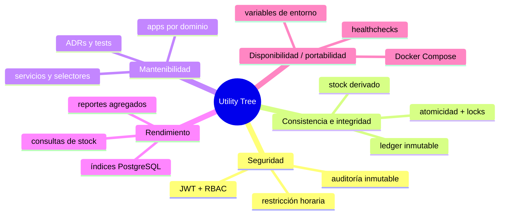

# Utility Tree del Sistema Inventario ICM

Este Utility Tree prioriza atributos de calidad derivados del backend real del proyecto. Cada escenario es verificable con el código, las pruebas o la infraestructura documentada.

## Vista general

## 1. Seguridad

**Prioridad:** Alta

| Escenario | Impacto | Dificultad | Justificación |
|---|---|---|---|
| Un `auxiliar_despacho` intenta operar fuera de 07:00–12:00 o 14:00–17:00 y el sistema rechaza la solicitud. | A | M | Es crítico para evitar operación no autorizada; la complejidad es media porque ya existe JWT, RBAC y validación horaria por request, pero requiere cuidado con timezone y permisos. |
| Un usuario sin permisos intenta gestionar credenciales o acceder a recursos protegidos y el sistema responde con 401/403. | A | M | Protege cuentas y datos sensibles; la implementación usa mecanismos maduros, pero exige consistencia en vistas, permisos y blacklisting. |
| Un evento sensible queda registrado en auditoría y puede rastrearse por usuario. | A | B | Impacta directamente el control operativo y el cumplimiento; la dificultad es baja porque el repo ya centraliza auditoría e identificación del ejecutor. |

## 2. Consistencia e integridad del inventario

**Prioridad:** Alta

| Escenario | Impacto | Dificultad | Justificación |
|---|---|---|---|
| Dos operaciones concurrentes de despacho intentan consumir el mismo stock y el sistema evita stock negativo. | A | A | Es el riesgo más crítico del dominio; la solución requiere transacciones, `select_for_update()`, constraints y pruebas sobre PostgreSQL real. |
| Un movimiento se crea y el stock derivado se actualiza en la misma transacción. | A | A | Si falla, el inventario queda inconsistente; la complejidad es alta porque involucra atomicidad, locks y rollback seguro. |
| El stock derivado se reconstruye desde el ledger y coincide con el valor actual. | A | M | Es clave para detectar y corregir desalineaciones; la implementación es compleja pero ya está favorecida por el modelo actual. |

## 3. Mantenibilidad

**Prioridad:** Alta

| Escenario | Impacto | Dificultad | Justificación |
|---|---|---|---|
| Se agrega una nueva regla de negocio sin tocar `views.py` ni `serializers.py` más allá de validación I/O. | A | B | El proyecto depende de esa separación para escalar; la dificultad es baja porque la convención ya existe y está documentada. |
| Un nuevo caso de negocio se implementa en `services.py` y se cubre con tests sin romper otras apps. | A | M | Asegura evolución segura; la dificultad es media por la necesidad de mantener trazabilidad RF/BR/RNF y tests de regresión. |
| La documentación de arquitectura y ADRs permanece alineada con el código. | M | B | Reduce deuda técnica y ambigüedad; la dificultad es baja si se mantiene la disciplina editorial. |

## 4. Rendimiento

**Prioridad:** Media

| Escenario | Impacto | Dificultad | Justificación |
|---|---|---|---|
| Un usuario consulta stock o reportes y obtiene respuesta ágil sin N+1. | M | M | Afecta la experiencia operativa, aunque no bloquea el negocio; requiere selectores, paginación e índices. |
| Un conjunto de reportes agregados se resuelve en BD y no en Python. | M | M | Mejora latencia y consumo de recursos; la implementación exige diseño cuidadoso de consultas y modelos. |
| El sistema soporta el catálogo actual y el crecimiento esperado sin degradación severa. | M | M | El monolito modular ayuda, pero el tamaño del dataset y los reportes condicionan el ajuste fino. |

## 5. Disponibilidad / portabilidad

**Prioridad:** Media

| Escenario | Impacto | Dificultad | Justificación |
|---|---|---|---|
| El sistema levanta de forma reproducible con Docker Compose en desarrollo y producción. | M | M | Impacta onboarding y operación; la dificultad es media porque ya existen Compose files, entrypoint y settings por entorno. |
| El contenedor productivo arranca solo cuando PostgreSQL está listo. | M | B | Reduce fallos de arranque; la dificultad es baja porque el repo ya usa healthchecks y `entrypoint.sh`. |
| La imagen de producción incluye dependencias runtime explícitas y arranca con `gunicorn`. | M | M | Es una restricción real del despliegue; requiere coordinación entre Dockerfile y requirements. |

## 6. Tabla de prioridad general

| Atributo | Prioridad | Motivo |
|---|---|---|
| Seguridad | Alta | La operación y los datos clínico-operativos dependen de autenticación, RBAC y auditoría. |
| Consistencia e integridad | Alta | Es el núcleo del inventario y el principal riesgo técnico del sistema. |
| Mantenibilidad | Alta | La arquitectura modular solo aporta valor si se preserva la separación por capas. |
| Rendimiento | Media | Importa para stock y reportes, pero no domina sobre la integridad. |
| Disponibilidad / portabilidad | Media | Está condicionada por Docker y PostgreSQL, sin un esquema HA distribuido en este alcance. |

## 7. Conclusión

El árbol muestra que el sistema prioriza **integridad del inventario**, **seguridad de acceso** y **mantenibilidad modular** por encima de optimizaciones avanzadas de disponibilidad o escalado distribuido.

Eso coincide con la arquitectura real: monolito modular, API REST versionada, servicios transaccionales y trazabilidad fuerte.
